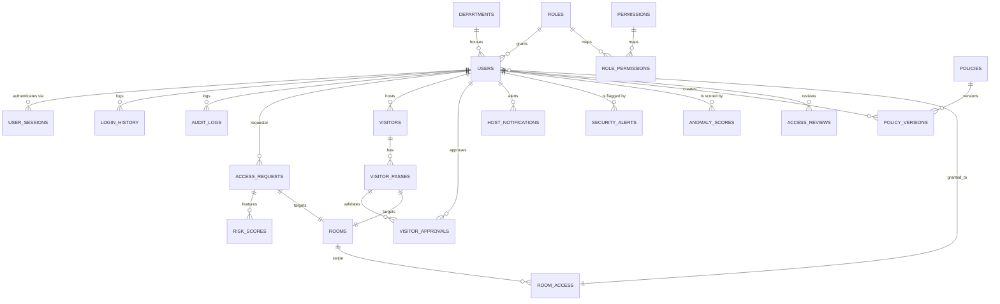

# Entra ID Access Governance System (RBAC App)

Phase 1 of an AI-Powered Enterprise Access Governance System featuring a FastAPI + PostgreSQL backend and a React + Vite + TailwindCSS admin dashboard modeled after Microsoft Entra ID (Azure Active Directory).

---

## Technical Architecture

```
                               +-----------------------------+
                               |    React + Vite Frontend    |
                               |    (Redux Store & Axios)    |
                               +--------------+--------------+
                                              | HTTPS Requests
                                              v
                               +--------------+--------------+
                               |     FastAPI Backend (API)   |
                               |  - Authentication Middleware|
                               |  - Auditing & Log Services  |
                               +--------------+--------------+
                                              | SQLAlchemy ORM
                                              v
                               +--------------+--------------+
                               |    PostgreSQL Database      |
                               |   (Governance Schema)       |
                               +-----------------------------+
```

---

## Directory Structure

```
bdl-project/
├── backend/
│   ├── app/
│   │   ├── api/             # API Router Endpoints
│   │   │   ├── auth.py
│   │   │   ├── users.py
│   │   │   ├── roles.py
│   │   │   ├── permissions.py
│   │   │   ├── departments.py
│   │   │   └── audit.py
│   │   ├── core/            # Configs, DB sessions, Security, Seeder
│   │   │   ├── config.py
│   │   │   ├── database.py
│   │   │   ├── security.py
│   │   │   └── seeder.py
│   │   ├── models/          # SQLAlchemy Models (User, Role, AuditLog, etc.)
│   │   ├── schemas/         # Pydantic validation schemas
│   │   ├── services/        # Business logic services (Auth, Audit loggers)
│   │   └── main.py          # FastAPI Main Entrypoint
│   ├── tests/               # pytest test suite files
│   ├── requirements.txt     # Python Dependencies
│   └── Dockerfile
├── frontend/
│   ├── src/
│   │   ├── components/      # Fluent Layout, Sidebar, Navbar, DataTable, Modal
│   │   ├── hooks/           # useAuth custom hook
│   │   ├── pages/           # Pages (Dashboard, Users, Roles, Profile, etc.)
│   │   ├── services/        # Axios interceptors configuration
│   │   ├── store/           # Redux Toolkit Config and Auth slice
│   │   ├── App.jsx          # Route manager with guards
│   │   ├── index.css        # Custom scrollbar & theme configs
│   │   └── main.jsx
│   ├── tailwind.config.js   # Microsoft palette configuration
│   ├── vite.config.js
│   ├── package.json
│   └── Dockerfile
├── docker-compose.yml       # Docker orchestrator configurations
├── .env                     # Local environment keys
└── README.md
```

---

## Role-Based Access Control (RBAC) Algorithm Analysis

### 1. Mathematical Formulation
Let:
- $U = \{u_1, u_2, ..., u_n\}$ represent the set of Users.
- $R = \{r_1, r_2, ..., r_k\}$ represent the set of Roles.
- $P = \{p_1, p_2, ..., p_m\}$ represent the set of Permissions.
- $D = \{d_1, d_2, ..., d_j\}$ represent the set of Departments.

Assignments are defined as relation subsets:
- **User-Role Assignment (URA)**: $URA \subseteq U \times R$
- **Role-Permission Assignment (RPA)**: $RPA \subseteq R \times P$
- **User-Department Assignment (UDA)**: $UDA \subseteq U \times D$

The active permissions for a given user $u$ is the union of all permissions assigned to all roles held by that user:
$$\text{ActivePermissions}(u) = \{ p \in P \mid \exists r \in R: (u, r) \in URA \wedge (r, p) \in RPA \}$$

In our implementation, if a user belongs to the `Administrator` role, access checks bypass individual list inspections:
$$\text{If } (u, \text{"Administrator"}) \in URA \implies \text{ActivePermissions}(u) = P$$

### 2. Time Complexity Analysis

- **Role Verification ($O(1)$)**: 
  The user's assigned role is embedded in their JWT token payload. Checking a user's role does not require a database query, resulting in $O(1)$ complexity.
  
- **Permission Checking ($O(1)$ average, $O(P_u)$ worst case)**:
  - *Naive Database Lookups*: Querying the database to fetch user roles and permissions on every check is expensive ($O(\text{Permissions} \times \text{Roles})$).
  - *Session-level Caching (Selected)*: By querying the user's role-permission associations once during request authentication and holding them in memory as a set, lookups are reduced to $O(1)$ average time.
  - *Worst Case*: On cache misses or token construction, it maps to $O(P_u)$ where $P_u$ is the number of active permissions mapped to the user's role.

### 3. Advantages & Disadvantages

| Advantages | Disadvantages |
|------------|---------------|
| **Simple Governance**: Easily manage large cohorts by assigning roles rather than individual keys. | **Role Explosion**: Fine-grained resources control (e.g. edit a specific document ID) requires creating too many roles. |
| **Principle of Least Privilege**: Establishes standard access bounds out-of-the-box. | **Lack of Dynamic Context**: Does not support attribute checks (like time of day, client IP, location). |
| **Auditing & Compliance**: Greatly simplifies SOC2, ISO27001, and HIPAA compliance verification. | **Inheritance Overhead**: Deep hierarchies can cause permission leaks if not audited regularly. |

### 4. Why RBAC was Selected
RBAC represents the industry standard for general corporate access management (e.g. Azure IAM, AWS IAM). It provides clean, scalable, and audit-friendly bounds that serve as a strong foundation before adding Attribute-Based Access Control (ABAC) in Phase 2.

---

## Installation & Setup Guide

### System Requirements
- [Docker](https://www.docker.com/products/docker-desktop/) and Docker Compose installed.
- Or locally: Python 3.10+ (for backend) and Node.js 18+ (for frontend).

### 1. Running with Docker (Recommended)

1. Clone or download the workspace.
2. In the root directory, create a `.env` file from the template:
   ```bash
   cp .env.example .env
   ```
3. Start the services with Docker Compose:
   ```bash
   docker-compose up --build
   ```
4. Access the web applications:
   - **Frontend UI**: [http://localhost:5173](http://localhost:5173)
   - **FastAPI API Swagger Docs**: [http://localhost:8000/docs](http://localhost:8000/docs)
   - **pgAdmin Database View**: [http://localhost:5050](http://localhost:5050)
     - *Login*: `admin@entra-rbac.com` / `AdminPass123!`
     - *Connection Host*: `db` | *Port*: `5432` | *Username*: `rbac_admin` | *Password*: `rbac_secure_password_2026`

---

## Seeding & Initial Credentials

On application startup, the database is automatically seeded with default data:
- **Global Administrator**: `admin@entra-rbac.com` / `AdminPass123!`
- **Manager**: `manager@entra-rbac.com` / `DemoPass123!`
- **Security Officer**: `security@entra-rbac.com` / `DemoPass123!`
- **Engineer**: `engineer@entra-rbac.com` / `DemoPass123!`
- **Intern**: `intern@entra-rbac.com` / `DemoPass123!`
- **Visitor**: `visitor@entra-rbac.com` / `DemoPass123!`

---

## Technical Architecture & Database Schema (ERD)



---

## Core Algorithms & Complexity Reference

### 1. RBAC Check
- **Concept**: User roles are resolved during authentication and cached as a permissions set. Swipes verify permissions in-memory.
- **Why Chosen**: Clean corporate structure matching standard Enterprise access controls.
- **Complexity**: $O(1)$ average lookup after token validation.

### 2. JWT Auth (Access + Refresh Flow)
- **Concept**: Short-lived (30 min) access tokens verify identity. Long-lived (7 day) refresh tokens request new access states and are stored securely in the database to allow remote session revocation.
- **Why Chosen**: Stateless scaling combined with active session monitoring capability.
- **Complexity**: $O(1)$ token verification, $O(1)$ session validation.

### 3. AI Access Copilot (RAG)
- **Concept**: NLP prompts are mapped using FAISS (or TF-IDF keyword match fallback) against stored compliance files, feeding contextual directives to the GPT pipeline.
- **Why Chosen**: Allows natural language access request routing without leaving security compliance bounds.
- **Complexity**: $O(D \cdot \log V)$ vector lookup where $D$ is documentation count and $V$ is vocabulary size.

### 4. Rule-Based Risk Scoring
- **Concept**: Weighted analysis over employee roles, duration, room requirements (requires escort), and historical clearance.
- **Why Chosen**: Ensures predictable threshold gating before AI recommendations reach manager queues.
- **Complexity**: $O(1)$ decision-tree execution.

### 5. Security Anomaly Detection (Isolation Forest, LOF, DBSCAN)
- **Concept**: Login and audit histories are feature-engineered into a multi-dimensional matrix. We fit an Isolation Forest (global outliers), Local Outlier Factor (density outliers), and DBSCAN (unclustered noise points) to identify brute-force login attempts and after-hours sweeps.
- **Why Chosen**: Unsupervised outlier voting reduces false positives while flagging subtle threat vectors.
- **Complexity**: $O(N \cdot \log N)$ training, $O(N)$ inference where $N$ is sample size.

### 6. Visitor Access State Machine (FSM)
- **Concept**: Tracks visitor passes from registration to completion. Transitions: `Pending` $\to$ `Active` (Approved/Checked In) $\to$ `Checked Out` / `Expired`.
- **Why Chosen**: Enforces strict entry/exit constraints for on-premise governance.
- **Complexity**: $O(1)$ state verification.

### 7. Policy Compliance Evaluation
- **Concept**: Checks for permission overlaps, role scopes, and login failures, and aggregates a percentage index by department.
- **Why Chosen**: Provides quick health scores for executive governance.
- **Complexity**: $O(U + D)$ where $U$ is total users and $D$ is departments.

---

## API Reference
The full interactive REST API is documented via OpenAPI/Swagger. Once the backend is running, access Swagger docs at:
- **Interactive Swagger Docs**: [http://localhost:8000/docs](http://localhost:8000/docs)
- **ReDoc View**: [http://localhost:8000/redoc](http://localhost:8000/redoc)

---

## Known Limitations & Stubbed Integrations
- **OpenAI Key**: If `OPENAI_API_KEY` is not set, RAG falls back to a TF-IDF matching engine and generates deterministic evaluation responses.
- **E-Mail/SMS Alerts**: Notifications to hosts are delivered internally inside the dashboard (`/visitors/notifications`) rather than via active Twilio/SendGrid links.

---

## Automated Backend Testing

To run backend tests locally:
1. Navigate to the backend directory:
   ```bash
   cd backend
   ```
2. Run test execution:
   ```bash
   venv\Scripts\pytest
   ```

